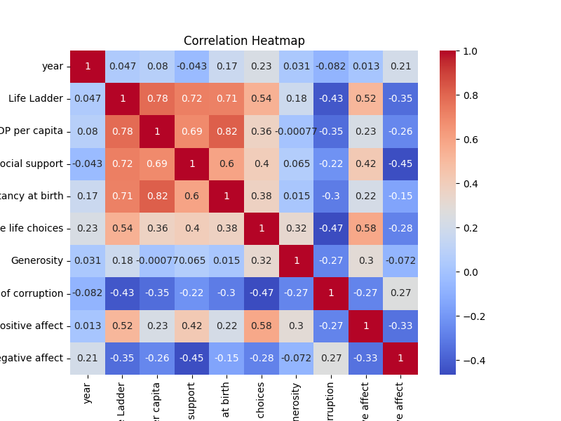

# README.md

## Dataset Overview

The **happiness.csv** dataset contains valuable information on various factors that influence happiness across different countries over a significant temporal scope.

- **Dimensions**: The dataset consists of **2,363 rows** and **10 columns**.
- **Time Span**: Collected data ranges from **2005 to 2023**, with an average year of **approximately 2014.76**. This allows for longitudinal analysis of happiness trends over time.

### Columns and Data Types

The dataset comprises both **numerical and categorical variables**. The numerical metrics include measurements related to happiness and its determinants (e.g., GDP, social support), while the sole categorical variable consists of **country names**.

### Missing Values

The dataset exhibits missing values across several columns:
- **Generosity** has the highest number of missing entries (**81**).
- Other columns with notable missing values include:
  - **Perceptions of corruption**: **125** missing entries.
  - **Healthy life expectancy at birth**: **63** missing entries.

This indicates a need for data imputation or careful consideration of these variables during analysis, especially in critical relationships.

## Key Findings from the Analysis

1. **Happiness Correlation Potential**: Happiness is positively correlated with **GDP**, **social support**, and **freedom of choice**. Further exploration is warranted to identify significant predictors of happiness.
  
2. **Disparities in Happiness**: A wide variation in happiness scores highlights major disparities between countries, likely linked to economic factors, social structures, and corruption perceptions.

3. **Handling Missing Data**: Significant missing values must be addressed, particularly in generosity and corruption perceptions, which could affect analysis outcomes.

4. **Temporal Insights**: Analyzing how happiness and its determinants have evolved over time is vital for understanding global trends.

5. **Positive vs. Negative Affect**: The balance of positive and negative affects is another useful avenue for further exploration in relation to other variables.

## Insights from Visualizations

While I can't view specific visual content such as heatmaps or charts, here are general guidelines on analyzing correlation heatmaps and their implications:

- **Correlation Coefficients**: Ranging from **-1 to 1**, coefficients close to **1** indicate strong positive correlation, while values close to **-1** indicate strong negative correlation. Values near **0** suggest minimal correlation.
  
- **Understanding Variables**: Examine the variables on the heatmap's axes to interpret correlations meaningfully.

- **Identifying Strong Correlations**: Look for colored cells (dark blue/red) which signify strong positive or negative correlations, respectively. 

- **Cluster Analysis**: Seek clusters of correlated variables to identify patterns.

- **Potential for Multicollinearity**: Identify highly correlated independent variables that could affect predictive model performance.

- **Outliers and Exceptions**: Investigate variables that deviate from expected correlations for deeper insights.

- **Contextual Analysis**: Frame findings within the context of happiness studies and existing theories.

## Implications and Recommendations

- **Data Cleaning**: Address missing values as a priority, utilizing imputation methods where necessary, particularly for vital analytical variables.

- **Correlation Analysis**: Conduct detailed correlation and regression analyses to investigate relationships between happiness and other variables, such as GDP and social support.

- **Visualization**: Create insightful visualizations (e.g., scatter plots) to illustrate relationships between happiness and key influencing factors across different countries. Consider including files such as:
  
  
  

- **Longitudinal Studies**: Explore changes in happiness metrics over time to account for shifts in social, economic, and political variables impacting well-being.

These insights and recommendations aim to deepen understanding of happiness correlations and enhance data analysis for further research. 

---

